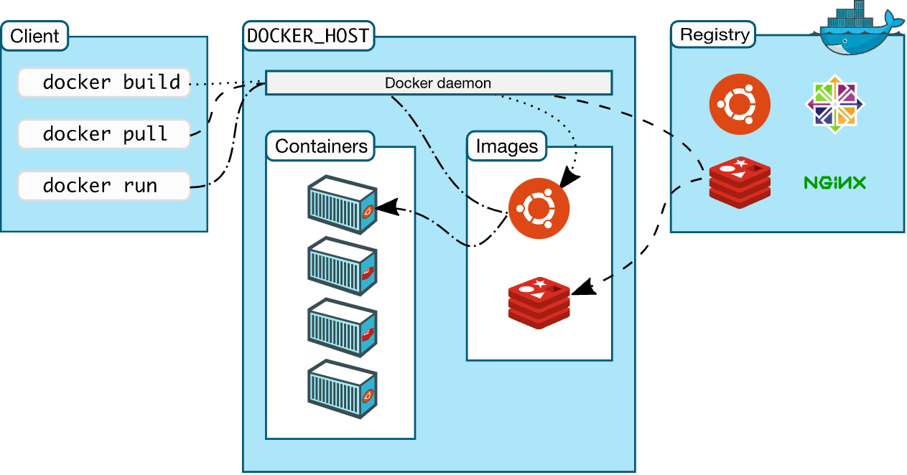
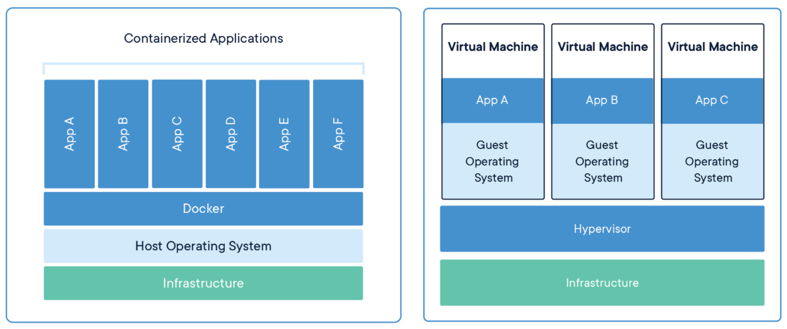

[](https://www.docker.com/)

# Docker Interview Savollari

# 🛑🛑ISHLAB CHIQISH JARAYONIDA🛑🛑
Biz docker bo'yicha intervyu savollarini jamlashga qaror qildik va sizga foydasi tegadi degan umiddamiz.

## Mundarija

<br/>

| No: |               Savollar          |
|-----|---------------------------------|
| 1.  |[Docker nima?](#docker-nima-)|
| 2.  |[Docker continer nima?](#Docker-container-nima-)|
| 3.  |[Docker image nima?](#docker-image-nima-)|
| 4.  |[Docker HUB nima?](#docker-hub-nima-)|
| 5.  |[Docker arxitekturasini tushuntirib bering?](#docker-arxitekturasini-tushuntirib-bering-)|
| 6.  |[Dockerfile nima?](#dockerfile-nima-)|
| 7.  |[Docker Compose haqida gapirib bering?](#docker-compose-haqida-gapirib-bering-)|
| 8.  |[Dockerfile Docker compose dan qanaqa farqi bor?](#dockerfile-docker-compose-dan-qanaqa-farqi-bor-)|
| 9.  |[Docker Swarm nima?](#docker-swarm-nima-)|
| 10. |[Docker Namespace nima?](#docker-namespace-nima-)|
| 11. |[What is the lifecycle of a Docker Container?](#what-is-the-lifecycle-of-a-docker-container-)|
| 12. |[Docker Machine ni tushuntirib bering?](#docker-machine-ni-tushuntirib-bering-)|
| 13. |[Ishlayotgan container ning ichiga qanday kirasiz ?](#ishlayotgan-container-ning-ichiga-qanday-kirasiz-)|
| 14. |[Docker container dan chiqib ketsangiz ma'lumot o'chib ketadimi ?](#docker-container-dan-chiqib-ketsangiz-malumot-ochib-ketadimi-)|
| 15. |[Docker qayerda ishlatiladi ?](#docker-qayerda-ishlatiladi-)|
| 16. |[Docker boshqa konteynerlashtirish usullaridan nimasi bilan farq qiladi?](#docker-boshqa-konteynerlashtirish-usullaridan-nimasi-bilan-farq-qiladi-)|
| 17. |[Docker-da compose fayl yaratish uchun YAML o'rniga JSON-dan foydalana olamanmi?](#docker-da-compose-fayl-yaratish-uchun-yaml-orniga-json-dan-foydalana-olamanmi-)|
| 18. |[Konteynerlar va virtual mashinalar o'rtasidagi farq nima?]()|
| 19. |[Hypervisor nima?](#konteynerlar-va-virtual-mashinalar-ortasidagi-farq-nima-)|
| 20. |[Virtualizatsiya nima?](#virtualizatsiya-nima-)|
| 21. |[Konteynerlash nima?](#konteynerlash-nima-)|
| 22. |[Virtualizatsiya va konteynerlashtirish o'rtasidagi farq?](#virtualizatsiya-va-konteynerlashtirish-ortasidagi-farq-)|
| 23. |[Docker konteynerining holatini aniqlashning  yo'li bormi?](#docker-konteynerining-holatini-aniqlashning--yoli-bormi-)|
| 24. |[Pauza qilingan konteynerni Docker dan o'chirib tashlay olasizmi?](#pauza-qilingan-konteynerni-docker-dan-ochirib-tashlay-olasizmi-)|
| 25. |[Konteyner o'z-o'zidan qayta ishga tushishi mumkinmi?](#konteyner-oz-ozidan-qayta-ishga-tushishi-mumkinmi-)|
| 26. |[rm buyrug'i yordamida konteynerni to'g'ridan-to'g'ri olib tashlash yoki konteynerni to'xtatish va keyin konteynerni olib tashlash ma'qulmi?](#rm-buyrugi-yordamida-konteynerni-togridan-togri-olib-tashlash-yoki-konteynerni-toxtatish-va-keyin-konteynerni-olib-tashlash-maqulmi-)|
| 27. |[Will cloud overtake the use of Containerization?](#will-cloud-overtake-the-use-of-containerization-)|
| 28. |[Har bir xost uchun qancha konteyner ishlashi mumkin?](#har-bir-xost-uchun-qancha-konteyner-ishlashi-mumkin-)|
| 29. |[Docker-da statistik ilovalarni ishga tushirish yaxshimi? or What type of applications - Stateless or Stateful are more suitable for Docker Container?](#docker-da-statistik-ilovalarni-ishga-tushirish-yaxshimi-or-what-type-of-applications---stateless-or-stateful-are-more-suitable-for-docker-container-)|
| 30. |[Dockerni ishlab chiqarishda qanday kuzatib borasiz?](#dockerni-ishlab-chiqarishda-qanday-kuzatib-borasiz-)|
| 31. |[Docker compose-ni ishlab chiqarishda ishlatish yaxshi amaliyotmi?](#docker-compose-ni-ishlab-chiqarishda-ishlatish-yaxshi-amaliyotmi-)|

<br/>

#### 1
##  ***🔖Docker nima ?***

**Docker** - bu konteynerlashtirish platformasi bo'lib, ilovangiz va uning barcha bog'liqliklarini konteynerlar ko'rinishida birlashtirib, ilovangiz har qanday muhitda, xoh u ishlab chiqish, sinovdan o'tkazish yoki ishlab chiqarishda muammosiz ishlashini ta'minlaydi.

<p align="center">
  
</p>


<div align="right">
     <b><a href="#mundarija">↥ Mundarijaga qaytish</a></b>
</div>

#### 2
##  ***🔖Docker container nima ?***

**Docker container** - bu docker image larni ishga tushirilgan variantidir. Tashqi muhitdan izolatsiyalanga holda ishlaydi. Izolyatsiyalangan deganda tizimda boshqa jarayonlar bilan bog’lanmagan  holda ishlaydi.

<div align="right">
     <b><a href="#mundarija">↥ Mundarijaga qaytish</a></b>
</div>

#### 3
##  ***🔖Docker image nima ?***

**Docker image** - bu Docker containerining manbai hisoblanadi. Docker image containerlarni yaratish uchun ishlatiladi. Agar foydalanuvchi Docker imageni ishga tushirsa, containerning namunasi yaratiladi. Ushbu docker image lari har qanday Docker muhitiga joylashtirilishi mumkin. 

<div align="right">
     <b><a href="#mundarija">↥ Mundarijaga qaytish</a></b>
</div>

#### 4
##  ***🔖Docker HUB nima ?***

**Docker Hub** - bu siz yaratgan docker imagelar saqlash mumkin bo’lgan joy ya’ni image lar saqlanadigan ombor hisoblnadi. U joyda hamma uchun umumiy bo’lgan docker imagelar oldindan yozib qo’yilgan siz ulardan olib foydalanishingiz ham mumkin va boshqalarga foydasi tegishi uchun o’zingiz yozgan docker imageni ham ular uchun taqdim etsangiz bo’ladi :)

<div align="right">
     <b><a href="#mundarija">↥ Mundarijaga qaytish</a></b>
</div>

#### 5
##  ***🔖Docker arxitekturasini tushuntirib bering ?***

**Docker mijoz-server arxitekturasi**da ishlaydi. Docker mijozi Docker Daemon bilan aloqa o'rnatadi. Docker mijozi va Daemon bir xil tizimda ishlashi mumkin. Docker mijozi masofaviy Docker Daemoniga ham ulanishi mumkin. Docker arxitekturasidagi Docker komponentlarining har xil turlari bor va ular quyidagilardir:

- **Docker Client**: Bu Docker Host bilan aloqa o'rnatish uchun Docker qurish va ishga tushirish operatsiyalarini bajaradi. Docker buyrug'i bajariladigan so'rovlarni chaqirish uchun Docker API-dan foydalanadi.
  
- **Docker Xost**: Ushbu komponentda Docker Demoni, Konteynerlar va uning tasvirlari mavjud. Tasvirlar konteynerlarda saqlanadigan ilovalar uchun metadata turi bo'ladi. Docker Demoni Registry bilan aloqa o'rnatadi.
  
- **Registry**: Ushbu komponent Docker tasvirlarini saqlaydi. Umumiy registrlar Docker Hub va Docker Cloud bo'lib, ulardan har kim foydalanishi mumkin.

<div align="right">
     <b><a href="#mundarija">↥ Mundarijaga qaytish</a></b>
</div>

#### 6
##  ***🔖Dockerfile nima ?***

Docker **Dockerfile** deb nomlangan fayldagi ko'rsatmalarni o'qish orqali avtomatik ravishda tasvirlarni yaratishi mumkin. Dockerfile - bu foydalanuvchi image ni yig'ish uchun buyruq satrida chaqirishi mumkin bo'lgan barcha buyruqlarni o'z ichiga olgan matnli hujjat. Docker build-dan foydalanib, foydalanuvchilar bir nechta buyruq qatori ko'rsatmalarini ketma-ket bajaradigan avtomatlashtirilgan tuzilmani yaratishi mumkin.

### Misol uchun:

```js
# alpine will download only basic version of node.js
FROM node:alpine

# Instead of root directory, program will use "/usr/app" directory
WORKDIR /usr/app

# Copy local directory to nodejs directory
COPY ./ ./

# Perform npm install
RUN npm install

# Run npm start in command prompt
CMD ["npm", "start"]
```
```js
docker build -t sofyspace/scm-website:latest .        // --tag , -t   ==> Name and optionally a tag in the 'name:tag' format
docker run -p 3000:3000 sofyspace/scm-website         // Project will run on local and will map to docker conatiner port 
```
<div align="right">
     <b><a href="#mundarija">↥ Mundarijaga qaytish</a></b>
</div>

#### 7
##  ***🔖Docker Compose haqida gapirib bering ?***

**Docker Compose** - bu ko'p konteynerli Docker ilovalarini aniqlash va ishga tushirish vositasi. Compose yordamida siz ilova xizmatlarini sozlash uchun YAML faylidan foydalanasiz. Keyin, bitta buyruq bilan siz konfiguratsiyangizdan barcha xizmatlarni yaratasiz va ishga tushirasiz. Docker Compose-dan alohida konteynerlar yaratish, ularni joylashtirish va bir-biri bilan mu'loqot qilish uchun foydalanishingiz mumkin. Har bir konteyner boshqa konteynerlar bilan aloqa qilish uchun portni ochadi.

**Misol uchun:**  MySQL service ni ko'rsak
```js
version: "3.7"

services:
  app:
    image: node:12-alpine
    command: sh -c "yarn install && yarn run dev"
    ports:
      - 3000:3000
    working_dir: /app
    volumes:
      - ./:/app
    environment:
      MYSQL_HOST: mysql
      MYSQL_USER: root
      MYSQL_PASSWORD: secret
      MYSQL_DB: todos

  mysql:
    image: mysql:5.7
    volumes:
      - todo-mysql-data:/var/lib/mysql
    environment:
      MYSQL_ROOT_PASSWORD: secret
      MYSQL_DATABASE: todos

volumes:
  todo-mysql-data:
```
```js
docker-compose up  // Start the App
docker-compose down   // Removing Volumes
```
<div align="right">
     <b><a href="#mundarija">↥ Mundarijaga qaytish</a></b>
</div>

#### 8
##  ***🔖Dockerfile Docker compose dan qanaqa farqi bor ?***

**Dockerfile** - bu oddiy matnli fayl bo'lib, unda foydalanuvchi tasvirni yig'ish uchun chaqirishi mumkin bo'lgan buyruqlar mavjud, 

**Docker Compose** esa ko'p konteynerli Docker ilovalarini aniqlash va ishga tushirish uchun vositadir. Docker Compose ilovangizni tashkil etuvchi xizmatlarni docker-compose.yml da aniqlaydi, shunda ular alohida muhitda birgalikda ishlaydi. U faqat docker-compose-ni ishga tushirish orqali bitta buyruqda ishlaydigan ilovani oladi. Agar loyihangizning docker-compose.yml fayliga qurish buyrug'i qo'shilsa, 
Docker compose Dockerfile faylidan foydalanadi. Sizning Docker ish jarayoni siz yaratmoqchi bo'lgan har bir image uchun mos Dockerfile yaratish bo'lishi kerak, so'ngra qurish buyrug'i yordamida image larni yig'ish uchun kompozitsiyadan foydalaning.

<div align="right">
     <b><a href="#mundarija">↥ Mundarijaga qaytish</a></b>
</div>

#### 9
##  ***🔖Docker Swarm nima ?***

**Docker Swarm** - bu Docker uchun mahalliy klaster. U Docker xostlar partalini yagona virtual Docker xostiga aylantiradi. Docker Swarm standart Docker API-ga xizmat qiladi, Docker daemoni bilan allaqachon aloqada bo'lgan har qanday vosita Swarm-dan bir nechta xostlarni shaffof ravishda o'lchash uchun foydalanishi mumkin.

<div align="right">
     <b><a href="#mundarija">↥ Mundarijaga qaytish</a></b>
</div>

#### 10
##  ***🔖Docker Namespace nima ?***

**Docker Namespace**  Linux xususiyatlaridan biri va konteynerlarning muhim tushunchasidir. Namespace konteynerlarda izolyatsiya qatlamini qo'shadi. Docker portativ bo'lib qolish va asosiy xost tizimiga ta'sir qilmaslik uchun turli nomlar bo'shliqlarini taqdim etadi. Docker tomonidan qo'llab-quvvatlanadigan bir nechta nom maydoni turlari - PID, Mount, IPC, User, Network

<div align="right">
     <b><a href="#mundarija">↥ Mundarijaga qaytish</a></b>
</div>

#### 11
##  ***🔖What is the lifecycle of a Docker Container ?***

Docker konteynerlari quyidagi hayot aylanishiga ega:

  1. Konteyner yaratish

  2. Konteynerni ishga tushirish

  3. Konteynerni to'xtatib turish (ixtiyoriy)
  
  4. To'xtab turgan Konteynerni ishga tushirish (ixtiyoriy)
  
  5. Konteynerni ishga tushirish
  
  6. Konteynerni to'xtatish
  
  7. Konteynerni qayta ishga tushirish
  
  8. Konteynerni o'chirish
  
  9. Konteynerni yo'q qilish

<div align="right">
     <b><a href="#mundarija">↥ Mundarijaga qaytish</a></b>
</div>

#### 12
##  ***🔖Docker Machine ni tushuntirib bering ?***

**Docker Machine** - virtual xostlarga Docker Engine o'rnatish imkonini beruvchi vositadir. Endi bu xostlarni docker-machine buyruqlari yordamida boshqarish mumkin. Docker Machine sizga Docker Swarm klasterlarini ta'minlashga ham imkon beradi.

<div align="right">
     <b><a href="#mundarija">↥ Mundarijaga qaytish</a></b>
</div>

#### 13
##  ***🔖Ishlayotgan container ning ichiga qanday kirasiz ?***

Quyidagi buyruq bizga ishlaydigan konteynerga kirish imkonini beradi:
```js
docker exec -it bash
```
**Exec** buyrug'i konteyner ichiga kirish va u bilan ishlash imkonini beradi.

<div align="right">
     <b><a href="#mundarija">↥ Mundarijaga qaytish</a></b>
</div>

#### 14
##  ***🔖Docker container dan chiqib ketsangiz ma'lumot o'chib ketadimi ?***

**Yo'q**, Docker konteyneri chiqqanda siz hech qanday ma'lumotni yo'qotmaysiz. Ilovangiz konteynerga yozgan har qanday ma'lumotlar siz konteynerni aniq o'chirmaguningizcha diskda saqlanadi. Konteynerning fayl tizimi konteyner to'xtagandan keyin ham saqlanib qoladi.

<div align="right">
     <b><a href="#mundarija">↥ Mundarijaga qaytish</a></b>
</div>

#### 15
##  ***🔖Docker qayerda ishlatiladi ?***

Docker quyidagi sohalarda qo'llaniladi:

* **Simplifying configuration :**  Docker sizga muhit va konfiguratsiyani kodga kiritish va uni joylashtirish imkonini beradi.

* **Code Pipeline boshqarish :** Ishlab chiqish va ishlab chiqarish uchun turli xil tizimlar qo'llaniladi. Kod ishlab chiqishdan sinovdan ishlab chiqarishgacha o'tganda, u atrof-muhitdagi farqdan o'tadi. Docker Code Pipeline lari mustahkamligini saqlashga yordam beradi.

* **Developer Productivity :** ishlab chiqish uchun Docker-dan foydalanish bizga ikkita narsani beradi - biz ishlab chiqarishga yaqinroqmiz va rivojlanish muhiti tezroq quriladi.

* **Application Isolation :** Konteynerlar barcha bog'liqliklar bilan birga o'ralgan ilovalar bo'lgani uchun ilovalaringiz izolyatsiya qilingan. Ular Docker-ni qo'llab-quvvatlaydigan har qanday uskunada mustaqil ishlashlari mumkin.

* **Debugging Capabilities :** Docker konteynerlarga xos bo'lmagan, ammo konteynerlar bilan yaxshi ishlaydigan turli tuzatish vositalarini qo'llab-quvvatlaydi.

* **Multi-tenancy :** Docker sizga kodlaringiz va joylashtirishlaringizdagi ortiqcha narsalarni oldini oluvchi ko'p foydalanuvchi ilovalariga ega bo'lish imkonini beradi.

* **Rapid Deployment :** Docker butun operatsion tizimni noldan qurish zaruratini yo'q qiladi va joylashtirish vaqtini qisqartiradi.

<div align="right">
     <b><a href="#mundarija">↥ Mundarijaga qaytish</a></b>
</div>

#### 16
##  ***🔖Docker boshqa konteynerlashtirish usullaridan nimasi bilan farq qiladi ?***

**Docker konteyner**larini har qanday bulutli platformada joylashtirish juda oson. Boshqa texnologiyalar bilan solishtirganda, u bir xil uskunada ishlaydigan ko'proq ilovalarni olishi mumkin, bu ishlab chiquvchilarga tezda, ishga tushirishga tayyor konteynerli ilovalarni yaratishni osonlashtiradi va ilovalarni boshqarish va joylashtirishni ancha osonlashtiradi. Siz hatto ilovalaringiz bilan konteynerlarni baham ko'rishingiz mumkin.

<div align="right">
     <b><a href="#mundarija">↥ Mundarijaga qaytish</a></b>
</div>

#### 17
##  ***🔖Docker-da compose fayl yaratish uchun YAML o'rniga JSON-dan foydalana olamanmi ?***

**Ha** - Yaratish uchun YAML o'rniga JSON dan foydalanishingiz mumkin, JSON faylidan compose bilan foydalanish uchun JSON fayl nomini belgilang. Masalan:
```js
docker-compose -f docker-compose.json up
```

<div align="right">
     <b><a href="#mundarija">↥ Mundarijaga qaytish</a></b>
</div>

#### 18
##  ***🔖Konteynerlar va virtual mashinalar o'rtasidagi farq nima ?***

<p align="center">
  
</p>

**Virtual mashinalar**:

Virtual mashina (VM) eng yaxshi jismoniy apparat yoki hisoblash tizimining funksionalligini taqlid qiluvchi dasturiy ta'minot sifatida tavsiflanadi. U gipervisor deb ataladigan taqlid qiluvchi dastur ustida ishlaydi, u asosiy jismoniy apparat resurslarining funksionalligini dasturiy muhit bilan takrorlaydi. Ushbu resurslarni xost mashinasi deb atash mumkin, gipervisorda ishlaydigan VM esa odatda mehmon mashinasi deb ataladi.

Virtual mashinada ilovalarni ishga tushirish uchun barcha kerakli elementlar mavjud, jumladan:

- Hisoblash
- Saqlash
- Xotira
- Tarmoqqa ulanish
- Uskuna funksiyasi virtuallashtirilgan tizim sifatida mavjud

VM shuningdek, ilovalarni ishga tushirish uchun zarur tizim ikkiliklari va kutubxonalarini o'z ichiga olishi mumkin. Biroq, haqiqiy operatsion tizim (OT) gipervisor yordamida boshqariladi va bajariladi.

**Konteynerlar**:

Konteynerlashtirish OS darajasida mavhumlikni yaratadi, bu ilovaning individual, modulli va alohida funksionalligini mustaqil ravishda ishlatish imkonini beradi. Natijada, bir nechta izolyatsiya qilingan ish yuklari - konteynerlar bir xil jismoniy resurslardan foydalangan holda dinamik ravishda ishlashi mumkin.

Konteynerlarning kamroq texnik ta'rifi bo'lishi mumkin: engil, ammo kodni, uning bog'liqligini va konfiguratsiyasini butunlay bitta tasvirga jamlagan dasturiy ta'minot birligi. Konteynerlar ishlashi mumkin:

- Yalang'och metall serverlar ustida
- Yuqori gipervisorlarda
- Bulutli infratuzilmada

Konteynerlar bitta asosiy farq bilan modulli ilova funksionalligi uchun izolyatsiya qilingan OS muhiti sifatida ishlash uchun barcha zarur imkoniyatlarni VM bilan baham ko'radi. Docker Engine kabi konteynerlashtirish mexanizmidan foydalanib, konteynerlar bir xil xost tizimi yadrosida bir nechta izolyatsiyalangan OS muhitlarini yaratadi, ularni ilovaning turli funktsiyalarini ishga tushirishga mo'ljallangan boshqa konteynerlar bilan bo'lishish mumkin. Faqat qutilar, kutubxonalar va boshqa ish vaqti komponentlari har bir konteyner uchun alohida ishlab chiqiladi yoki bajariladi, bu esa VM larga nisbatan ularni resurslardan samaraliroq qiladi.

<div align="right">
     <b><a href="#mundarija">↥ Mundarijaga qaytish</a></b>
</div>

#### 19
##  ***🔖Gipervisor nima ?***

**Gipervisor** - bu virtualizatsiya qilish imkonini beruvchi dastur. Uni Virtual Machine Monitor deb ham atashadi. U xost tizimini ajratadi va resurslarni har bir bo'lingan virtual muhitga ajratadi. Bitta xost tizimida asosan bir nechta operatsion tizimga ega bo'lishingiz mumkin. Gipervisorlarning ikki turi mavjud:

- **1-toifa:** U Native Hypervisor yoki Bare Metal Hypervisor deb ham ataladi. U bevosita asosiy xost tizimida ishlaydi. U sizning xostingizning tizim uskunasiga to'g'ridan-to'g'ri kirish huquqiga ega va shuning uchun asosiy server operatsion tizimini talab qilmaydi.
 
- **2-toifa:** Ushbu turdagi gipervisor asosiy xost operatsion tizimidan foydalanadi. U shuningdek Xostlangan Hypervisor deb ataladi.

<div align="right">
     <b><a href="#mundarija">↥ Mundarijaga qaytish</a></b>
</div>

#### 20
##  ***🔖Virtualizatsiya nima ?***

**Virtualizatsiya** - bu dasturiy ta'minotga asoslangan, biror narsaning virtual versiyasini (hisoblash xotirasi, serverlar, ilovalar va boshqalar) yaratish jarayoni. Ushbu virtual versiyalar yoki muhitlar bitta jismoniy apparat tizimidan yaratilgan. Virtualizatsiya bir tizimni alohida, alohida tizimlar kabi ishlaydigan ko'plab turli bo'limlarga bo'lish imkonini beradi. Hypervisor deb nomlangan dastur bunday bo'linish imkonini beradi. Gipervisor tomonidan yaratilgan virtual muhit Virtual mashina deb ataladi.

<div align="right">
     <b><a href="#mundarija">↥ Mundarijaga qaytish</a></b>
</div>

#### 21
##  ***🔖Konteynerlash nima ?***

Odatda, dasturiy ta'minotni ishlab chiqish jarayonida, bitta mashinada ishlab chiqilgan kod, bog'liqlik tufayli boshqa biron bir mashinada yaxshi ishlamasligi mumkin. Ushbu muammoni konteynerlashtirish kontseptsiyasi hal qilindi. Shunday qilib, asosan, ishlab chiqilayotgan va o'rnatilayotgan dastur barcha konfiguratsiya fayllari va bog'liqliklari bilan birga yig'iladi va o'raladi. Ushbu to'plam konteyner deb ataladi. Endi dasturni boshqa tizimda ishga tushirmoqchi bo'lganingizda, barcha bog'liqliklar va kutubxonalar bir-biriga bog'langanligi sababli xatosiz muhitni ta'minlaydigan konteyner o'rnatiladi. Eng mashhur konteynerlashtirish muhitlari Docker va Kubernetesdir.

<div align="right">
     <b><a href="#mundarija">↥ Mundarijaga qaytish</a></b>
</div>

#### 22
##  ***🔖Virtualizatsiya va konteynerlashtirish o'rtasidagi farq ?***

Konteynerlar dasturni ishga tushirish uchun izolyatsiya qilingan muhitni ta'minlaydi. Butun foydalanuvchi maydoni aniq dasturga bog'langan. Konteyner ichida qilingan har qanday o'zgarishlar hech qachon xostda yoki hatto bitta xostda ishlaydigan boshqa konteynerlarda tasir qilmaydi. Konteynerlar izolatsiya bo'lib ishlaydi va har biri alohida bir biriga ta'sirsiz ishlaydi.

Virtualizatsiyada gipervisorlar mehmonga butun virtual mashinani taqdim etadilar (shu jumladan Kernal). Virtual mashinalar apparat qatlamining abstraktsiyasidir. Har bir VM jismoniy mashinadir. VM ko'proq izolyatsiya qilingan va og'ir va boshlash uchun ko'p vaqt talab etiladi.

<div align="right">
     <b><a href="#mundarija">↥ Mundarijaga qaytish</a></b>
</div>

#### 23
##  ***🔖Docker konteynerining holatini aniqlashning  yo'li bormi ?***

Har qanday joyda konteyner bo'lishi mumkin bo'lgan oltita holat mavjud:

1. Created (yaratmoq)
2. Running (ishga tushurmoq)
3. Paused (vaqtincha to'xtatish ya'ni pauza qilish)
4. Restarting (qayta ishga tushurish)
5. Exited (kontainerdan chiqib ketish)
6. Dead. (kontainerni yo'q qilmoq)

Istalgan joyda docker holatini tekshirish uchun quyidagi buyruqdan foydalaning: ```$ docker ps``` Yuqoridagi buyruq  bo'yicha faqat ishlaydigan konteynerlar ro'yxatini ko'rsatadi. Barcha konteynerlarni qidirish uchun quyidagi buyruqdan foydalaning: ```$ docker ps -a```

<div align="right">
     <b><a href="#mundarija">↥ Mundarijaga qaytish</a></b>
</div>

#### 24
##  ***🔖Pauza qilingan konteynerni Docker dan o'chirib tashlay olasizmi ?***

**Yo'q** Siz pauza qilingan kontainerni O'chirib tashlay olmaysiz. Kontainerni olib tashlash uchun u butkul to'xtagan bo'lishi kerak ya'ni stop qilingan bo'lishi kerak. Shundagina uni o'chirib tashlashingiz mumkin.

<div align="right">
     <b><a href="#mundarija">↥ Mundarijaga qaytish</a></b>
</div>

#### 25
##  ***🔖Konteyner o'z-o'zidan qayta ishga tushishi mumkinmi ?***

**Yo'q**  Konteyner o'z-o'zidan qayta ishga tushishi mumkin emas.
Standart o'rnatilganda odatda kontayner ```restart``` buyrug'i bilan qayta ishga tushadi.

<div align="right">
     <b><a href="#mundarija">↥ Mundarijaga qaytish</a></b>
</div>

#### 26
##  ***🔖rm buyrug'i yordamida konteynerni to'g'ridan-to'g'ri olib tashlash yoki konteynerni to'xtatish va keyin konteynerni olib tashlash ma'qulmi ?***

**Docker Machine** - virtual xostlarga Docker Engine o'rnatish imkonini beruvchi vositadir. Endi bu xostlarni docker-machine buyruqlari yordamida boshqarish mumkin. Docker Machine sizga Docker Swarm klasterlarini ta'minlashga ham imkon beradi.

<div align="right">
     <b><a href="#mundarija">↥ Mundarijaga qaytish</a></b>
</div>

#### 27
##  ***🔖Will cloud overtake the use of Containerization ?***

**Docker Machine** - virtual xostlarga Docker Engine o'rnatish imkonini beruvchi vositadir. Endi bu xostlarni docker-machine buyruqlari yordamida boshqarish mumkin. Docker Machine sizga Docker Swarm klasterlarini ta'minlashga ham imkon beradi.

<div align="right">
     <b><a href="#mundarija">↥ Mundarijaga qaytish</a></b>
</div>

#### 28
##  ***🔖Har bir xost uchun qancha konteyner ishlashi mumkin ?***

**Docker Machine** - virtual xostlarga Docker Engine o'rnatish imkonini beruvchi vositadir. Endi bu xostlarni docker-machine buyruqlari yordamida boshqarish mumkin. Docker Machine sizga Docker Swarm klasterlarini ta'minlashga ham imkon beradi.

<div align="right">
     <b><a href="#mundarija">↥ Mundarijaga qaytish</a></b>
</div>

#### 29
##  ***🔖Docker-da statistik ilovalarni ishga tushirish yaxshimi? or What type of applications - Stateless or Stateful are more suitable for Docker Container ?***

**Docker Machine** - virtual xostlarga Docker Engine o'rnatish imkonini beruvchi vositadir. Endi bu xostlarni docker-machine buyruqlari yordamida boshqarish mumkin. Docker Machine sizga Docker Swarm klasterlarini ta'minlashga ham imkon beradi.

<div align="right">
     <b><a href="#mundarija">↥ Mundarijaga qaytish</a></b>
</div>

#### 30
##  ***🔖Dockerni ishlab chiqarishda qanday kuzatib borasiz ?***

**Docker Machine** - virtual xostlarga Docker Engine o'rnatish imkonini beruvchi vositadir. Endi bu xostlarni docker-machine buyruqlari yordamida boshqarish mumkin. Docker Machine sizga Docker Swarm klasterlarini ta'minlashga ham imkon beradi.

<div align="right">
     <b><a href="#mundarija">↥ Mundarijaga qaytish</a></b>
</div>

#### 31
##  ***🔖Docker compose-ni ishlab chiqarishda ishlatish yaxshi amaliyotmi ?***

**Docker Machine** - virtual xostlarga Docker Engine o'rnatish imkonini beruvchi vositadir. Endi bu xostlarni docker-machine buyruqlari yordamida boshqarish mumkin. Docker Machine sizga Docker Swarm klasterlarini ta'minlashga ham imkon beradi.

<div align="right">
     <b><a href="#mundarija">↥ Mundarijaga qaytish</a></b>
</div>

#### 32
↘️➡️⬇️⬇️⬇️**Davom etayabdi 25 gacha bo'ldi** ⬇️⬇️⬇️⬅️↙️